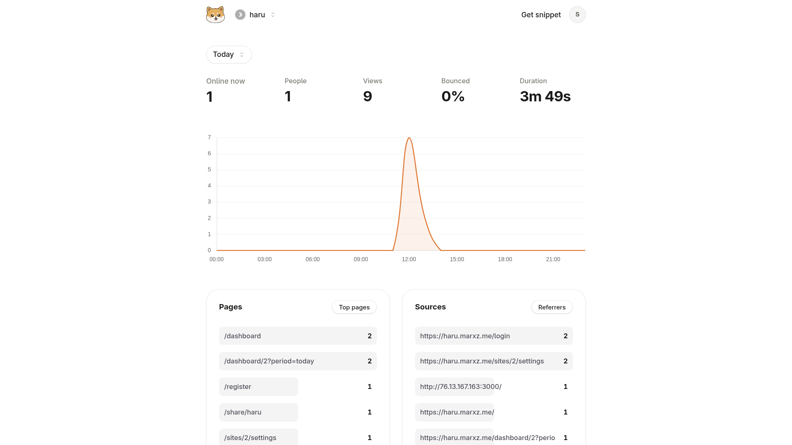

# Haru Analytics



A lightweight, self-hosted web analytics platform built with **Elixir / Phoenix LiveView**. Tracks pageviews, referrers, devices and countries in real time — without cookies, without third parties.

Built as a portfolio project to demonstrate production-quality OTP patterns, real-time data pipelines, and a clean umbrella application structure.

---

## Features

- **Real-time dashboard** — live visitor count, 24h pageview chart, top pages, referrers, countries and devices
- **Multi-site support** — each site gets an isolated API token; switch between sites from a single account
- **Sub-10ms tracking** — `/api/collect` responds immediately via `Task.Supervisor` fire-and-forget writes
- **ETS stats cache** — aggregated stats cached per site with 60 s TTL; invalidated on every new event
- **GDPR-friendly** — IP addresses are SHA-256 hashed before storage; raw IPs are never persisted
- **Rate limiting** — Hammer 7.x (ETS backend) limits tracking to 100 req / min / IP
- **Public sharing** — generate a read-only public link for any site dashboard
- **JS snippet** — < 2 kb vanilla JS, `sendBeacon`-first with XHR fallback, SPA-aware via History API

---

## Prerequisites

- Elixir 1.16+ / OTP 26+
- PostgreSQL 14+ **or** Docker + Docker Compose
- Node.js 18+ (for asset compilation)

---

## Quick Start

### With Docker (recommended)

```bash
# Start PostgreSQL
docker compose up -d

# Install Elixir deps
mix deps.get

# Install JS deps
cd apps/haru_web/assets && npm install && cd ../../..

# Create, migrate and seed the database
mix ecto.setup

# Start the server
mix phx.server
```

### Without Docker

Make sure PostgreSQL is running locally on port 5432 with user/password `postgres/postgres`, then:

```bash
mix deps.get
cd apps/haru_web/assets && npm install && cd ../../..
mix ecto.setup
mix phx.server
```

Open [http://localhost:4000](http://localhost:4000)

**Dev credentials:** `dev@haru.local` / `devsecret123456`

---

## Embedding the Tracking Snippet

Add the following to the `<head>` of any page you want to track:

```html
<script defer
  src="https://yourharu.com/js/haru.js"
  data-token="YOUR_SITE_API_TOKEN"
  data-api="https://yourharu.com">
</script>
```

The snippet automatically tracks pageviews, respects `History.pushState` for SPAs, and uses `sendBeacon` on session end so that no events are lost on tab close.

### Testing with curl

```bash
curl -X POST http://localhost:4000/api/collect \
  -H "Authorization: Bearer <site_api_token>" \
  -H "Content-Type: application/json" \
  -d '{"p":"/home","r":"https://google.com","sw":1920,"sh":1080}'
# → 200 OK in < 10ms
```

---

## Architecture

The project is an **Elixir Umbrella** with two apps:

| App | Responsibility |
|---|---|
| `haru_core` | Business logic, Ecto schemas, contexts, OTP supervision tree |
| `haru_web` | Phoenix HTTP layer, LiveView dashboard, controllers, routing |

### Supervision Tree

```
HaruCore.Application
├── HaruCore.Repo                          (Ecto DB pool)
├── Phoenix.PubSub [HaruCore.PubSub]       (cross-app messaging)
├── Registry [HaruCore.SiteRegistry]       (named process lookup)
├── DynamicSupervisor [Sites.DynamicSupervisor]
│   ├── SiteServer(site_id=1)              (per-site GenServer, active visitor window)
│   └── SiteServer(site_id=N)
├── StatsCache                             (ETS table, read_concurrency: true)
├── StatsRefresher                         (60s periodic DB → cache refresh)
└── Task.Supervisor [HaruCore.Tasks]       (async event writes)

HaruWeb.Application
├── HaruWebWeb.Telemetry
├── HaruWebWeb.RateLimiter                 (Hammer ETS backend)
└── HaruWebWeb.Endpoint
```

### Request Flow: Tracking Endpoint

```
POST /api/collect
  → TrackingRateLimit plug   (100 req/min/IP via Hammer)
  → CollectController
      1. extract Bearer token from header (or ?t= param)
      2. Sites.get_site_by_token          → 401 if not found
      3. Sites.Supervisor.ensure_started  → lazy SiteServer spawn
      4. SiteServer.record_event          → GenServer cast (~µs)
      5. Task.Supervisor.start_child      → async:
           a. Analytics.create_event      (Ecto insert)
           b. StatsCache.invalidate       (site_id)
           c. PubSub.broadcast "site:{id}" {:new_event, site_id}
      6. send_resp 200 ""                 ← immediate response
```

### Real-time Dashboard Flow

```
LiveView.mount
  → subscribe "site:#{site_id}"
  → Analytics.get_stats       (ETS cache hit, or DB query + cache store)
  → push_event "update_chart" → Chart.js hook

LiveView.handle_info {:new_event, site_id}
  → Analytics.get_stats       (cache invalidated → fresh query)
  → SiteServer.active_visitors (in-memory 5-min rolling window)
  → push_event "update_chart"
```

### Key Design Decisions

| Decision | Choice | Reason |
|---|---|---|
| Database | PostgreSQL + Ecto | Predictable, no extra services; TimescaleDB adds complexity |
| Async writes | `Task.Supervisor` fire-and-forget | Keeps tracking response under 10ms regardless of DB load |
| Caching | ETS `read_concurrency: true` | High-throughput concurrent reads without a bottleneck |
| Rate limiting | Hammer 7.x ETS backend | No Redis needed for single-node deployments |
| PII handling | SHA-256 `ip_hash` only | GDPR compliance while still counting unique visitors accurately |
| PubSub owner | `HaruCore.Application` | Web layer stays stateless; core owns all shared state |

---

## Tech Stack

| Layer | Technology |
|---|---|
| Language | Elixir 1.16+ / OTP 26+ |
| Web framework | Phoenix 1.8 + LiveView 1.1 |
| Database | PostgreSQL via Ecto 3.13 |
| Real-time | Phoenix PubSub |
| Caching | ETS (Erlang Term Storage) |
| Rate limiting | Hammer 7.x (ETS backend) |
| Frontend | TailwindCSS + DaisyUI + Chart.js |
| Linting | Credo |

---

## Development

```bash
# Run tests
mix test

# Lint
mix credo --strict

# Lint + compile warnings as errors
mix check

# Reset the database
mix ecto.reset
```

---

## Deployment

The project ships with a `Dockerfile` and `docker-compose.prod.yml` for containerised deployment.

```bash
# Build the release image
docker build -t haru .

# Run with your production env file
docker compose -f docker-compose.prod.yml up -d
```

Copy `.env.prod.example` to `.env.prod` and fill in the required values before deploying.

---

## Project Structure

```
haru/
├── apps/
│   ├── haru_core/              # Business logic
│   │   ├── lib/haru_core/
│   │   │   ├── accounts/       # User auth (registration, sessions, tokens)
│   │   │   ├── analytics/      # Event schema + stats queries
│   │   │   ├── sites/          # Site management + per-site GenServer
│   │   │   └── cache/          # ETS stats cache + periodic refresher
│   │   └── priv/repo/
│   │       └── migrations/
│   └── haru_web/               # Phoenix web layer
│       ├── lib/haru_web_web/
│       │   ├── live/           # LiveView: dashboard, settings, public view
│       │   ├── controllers/    # Session, registration, API collect
│       │   ├── components/     # CoreComponents design system
│       │   └── plugs/          # Auth, rate limiting
│       └── assets/
│           ├── js/
│           │   ├── haru.js     # Tracking snippet (< 2kb)
│           │   └── hooks/      # Chart.js LiveView hooks
│           └── css/
├── config/
└── docker-compose.yml
```
